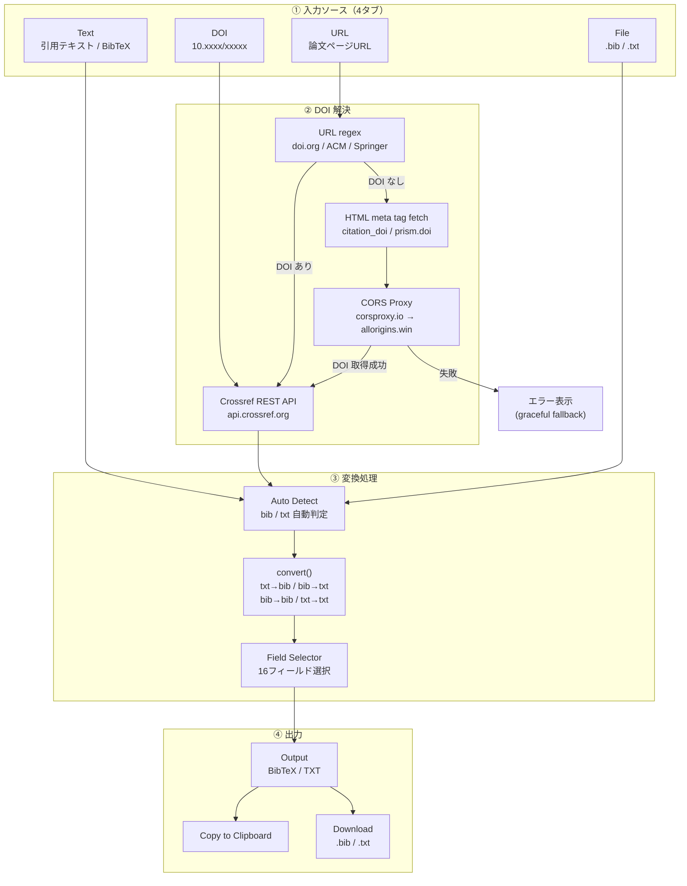

# Citation ⇄ BibTeX Converter

研究・卒論・論文執筆における引用形式変換の手間を削減する、研究向け Web アプリケーションです。

[](https://react.dev)
[](https://www.typescriptlang.org)
[](https://vitejs.dev)
[](https://www.crossref.org/documentation/retrieve-metadata/rest-api/)
[](LICENSE)

---

## プロジェクト概要

論文執筆・文献管理の現場では、引用サイトによって「Cite This」の形式が異なったり、BibTeX しかない・TXT しかない・DOI の取得が面倒といった問題が頻繁に発生します。本プロジェクトは、**自分の研究体験から着想した**この非効率を解消するための Web アプリです。

- 引用テキスト (TXT) を入力するだけで BibTeX を生成
- BibTeX から必要なフィールドだけを抽出・整形
- DOI または論文 URL を貼り付けるだけで自動的に引用情報を取得
- `.bib` / `.txt` ファイルのアップロードにも対応

バックエンド・データベース不要。ブラウザだけで完結します。

---

## 課題背景

千葉工業大学 2026年前期「Web3・AI概論」の第6回課題（テーマ：プロトタイプ v1）として作成しました。

**解決したかった問題：**  
論文を書くとき、引用元によって形式がバラバラで毎回手作業が発生していた。IEEE は `Cite This` の TXT 形式しか出ない、ScienceDirect は BibTeX があるが不完全、ACM は形式が独自…。一つの統一ツールで「とにかく BibTeX にする」「とにかく TXT にする」が完結してほしかった。

**対象ユーザー：**  
論文執筆中の学部生・大学院生・研究者。LaTeX / Overleaf ユーザー、または Zotero 等の文献管理ツールへのインポートをしたい人。

**一言紹介：**  
DOI か URL を貼るだけで BibTeX が手に入る、研究者のための引用変換ツール。

**公開 URL：** `[TODO: Vercel URL を記載`](https://citation-bibtex-converter.vercel.app/)

---

## アーキテクチャ



---

## 主な機能と特徴

1. **Citation ⇄ BibTeX 相互変換**  
   TXT→BibTeX / BibTeX→TXT / BibTeX→BibTeX（フィールド絞り込み）/ TXT→TXT の 4 モードに対応。入力内容から `@article` 等を検出してモードを自動判定します。

2. **DOI / URL Citation Fetch**  
   DOI（`10.xxxx/xxxxx`）または doi.org リンクを入力すると、Crossref REST API から著者・タイトル・巻号・ページ・DOI を取得して BibTeX を自動生成します。ACM や Springer の URL にはパス内の DOI を正規表現で検出します。

3. **URL からの DOI 自動解決**  
   DOI が URL に含まれない場合（IEEE 等）は、ページの HTML メタタグ（`citation_doi`）をフェッチして DOI を取得します。直接フェッチが CORS でブロックされる場合は CORS プロキシ 2 段階にフォールバックし、全失敗時は 15 秒でタイムアウトして分かりやすいエラーを表示します。

4. **Upload & Auto Detect**  
   `.bib` / `.txt` ファイルをアップロードまたはドラッグ&ドロップすると、内容から入力タイプを自動判定します。

5. **Field Selector**  
   出力に含めるフィールドをチェックボックスで選択できます（author / title / journal / doi / abstract 等 16 項目）。「abstract と keywords は除いて出力したい」といった用途に対応します。

6. **Validation Warning**  
   著者・タイトル・発行年・ページ・DOI の欠損を変換後に警告表示します。不完全な引用データに気づけます。

7. **Copy / Download**  
   出力テキストをクリップボードにコピー、または `.bib` / `.txt` ファイルとしてダウンロードできます。

---

## Screenshot

> **Add screenshot here.**  
> `docs/screenshot.png` を配置後、以下のコメントアウトを解除してください。

<!--  -->

---

## 対応ソース

| ソース | 例 | DOI 取得方法 | 状態 |
|---|---|---|---|
| DOI 直接入力 | `10.1016/j.ipm.2020.102250` | — | ✅ 確実 |
| doi.org リンク | `https://doi.org/10.xxxx/xxxxx` | URL 正規表現 | ✅ 確実 |
| ACM Digital Library | `https://dl.acm.org/doi/10.xxxx/xxxxx` | URL 正規表現 | ✅ 確実 |
| Springer | `https://link.springer.com/article/10.xxxx/xxxxx` | URL 正規表現 | ✅ 確実 |
| IEEE Xplore | `https://ieeexplore.ieee.org/document/xxxxxxx` | HTML メタタグ | ⚠️ サイト制限により失敗する場合あり |
| ScienceDirect | `https://www.sciencedirect.com/...` | HTML メタタグ | ⚠️ サイト制限により失敗する場合あり |

> IEEE・ScienceDirect で取得できない場合は、論文ページに表示されている DOI を **DOI タブ** から直接入力してください。

---

## 開発・動作環境

- **Frontend**: React 18, TypeScript 5, Vite 5
- **Citation Metadata**: Crossref REST API（無料・登録不要）
- **Styling**: Plain CSS (CSS Custom Properties、Tailwind 等不使用)
- **AI Assistant**: Claude Code (Anthropic) / Antigravity
- **Deployment**: Vercel（予定）

---

## ファイル構成

```text
citation-bibtex-converter/
├── src/
│   ├── App.tsx              # メインコンポーネント・状態管理・UI全体
│   ├── parseCitation.ts     # 引用変換ロジック（TXT ⇄ BibTeX、フィールド制御）
│   ├── fetchCitation.ts     # DOI/URL 解決・Crossref API 連携・CORS プロキシ
│   ├── index.css            # スタイル定義（CSS カスタムプロパティ）
│   └── main.tsx             # アプリエントリーポイント
├── index.html               # Vite HTML テンプレート
├── vite.config.ts           # Vite 設定
├── tsconfig.json            # TypeScript 設定
└── package.json
```

主要ロジックは `parseCitation.ts`（変換）と `fetchCitation.ts`（API 連携）の 2 ファイルに分離しています。詳細な設計については各ファイルのコメントを参照してください。

---

## 制限事項

- **IEEE / ScienceDirect URL 取得**：Cloudflare 等のボット対策により HTML メタタグのフェッチが失敗することがあります。DOI の直接入力を推奨します。
- **CORS 制限**：ブラウザのセキュリティポリシーにより一部サイトへの直接 fetch が不可です。CORS プロキシ 2 段階（corsproxy.io → allorigins.win）にフォールバックしますが、それでも失敗するサイトがあります。
- **Crossref 未登録 DOI**：Crossref に登録されていない DOI は 404 エラーになります（アプリの問題ではありません）。
- **TXT 解析精度**：引用テキストの書式が標準的でない場合、一部フィールドが抽出されないことがあります。

---

## Roadmap

- [ ] 複数引用の一括変換（バッチ処理）
- [ ] Citation Key の自動生成ルール設定
- [ ] BibTeX エントリタイプ選択（`@inproceedings` / `@book` 等）
- [ ] RIS / EndNote 形式へのエクスポート
- [ ] 対応出版社 URL の拡充

---

## 備考

本リポジトリは、千葉工業大学「Web3・AI概論」第6回課題の要件である以下を満たすよう作成しています。

1. AI 支援（Claude Code / Antigravity）を活用したプロトタイプ開発
2. 研究・学習上の実課題を解決するプロダクトの試作
3. GitHub へのソースコード公開
4. Vercel へのデプロイ（予定）

---

## License

[MIT License](LICENSE)
