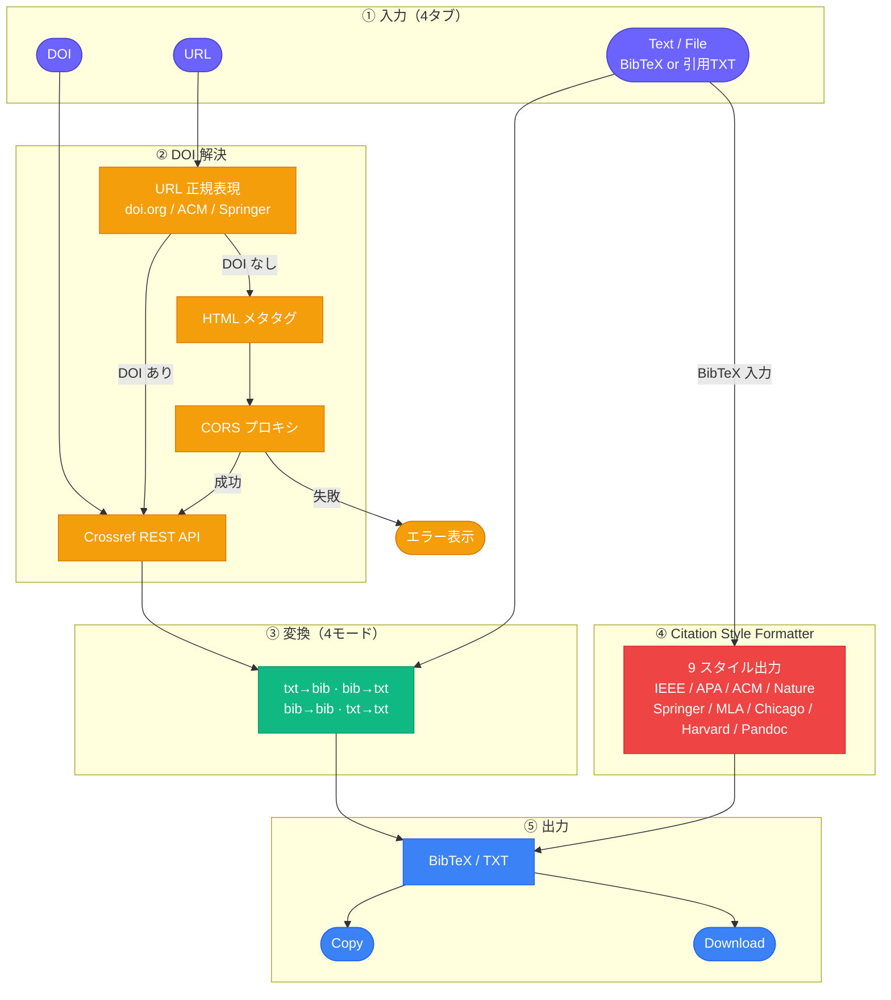
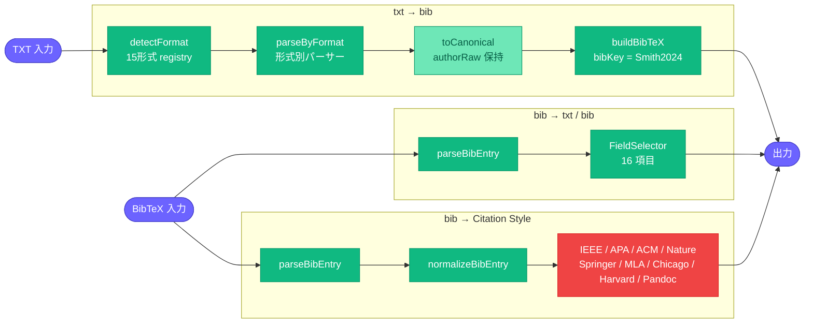

# Citation ⇄ BibTeX Converter

研究・卒論・論文執筆における引用形式変換の手間を削減する、研究向け Web アプリケーションです。

[](https://react.dev)
[](https://www.typescriptlang.org)
[](https://vitejs.dev)
[](https://www.crossref.org/documentation/retrieve-metadata/rest-api/)
[](LICENSE)

---

## プロジェクト概要

論文執筆・文献管理の現場では、引用サイトによって「Cite This」の形式が異なったり、BibTeX しかない・TXT しかない・DOI の取得が面倒といった問題が頻繁に発生します。本プロジェクトは、**自分の研究体験から着想した**この非効率を解消するための Web アプリです。

- 引用テキスト (TXT) を入力するだけで BibTeX を生成（15 形式対応・日本語引用含む）
- BibTeX から **IEEE / APA / ACM / Nature / Springer / MLA / Chicago / Harvard / Pandoc** 形式に変換
- DOI または論文 URL を貼り付けるだけで自動的に引用情報を取得
- 複数文献の一括変換（バッチ処理）に対応
- `.bib` / `.txt` ファイルのアップロードにも対応

バックエンド・データベース不要。ブラウザだけで完結します。

**公開 URL：** https://citation-bibtex-converter.vercel.app/

---

## 課題背景

千葉工業大学 2026年前期「Web3・AI概論」の第6回課題（テーマ：プロトタイプ v1）として作成しました。

**解決したかった問題：**
論文を書くとき、引用元によって形式がバラバラで毎回手作業が発生していた。IEEE は `Cite This` の TXT 形式しか出ない、ScienceDirect は BibTeX があるが不完全、ACM は形式が独自…。一つの統一ツールで「とにかく BibTeX にする」「とにかく TXT にする」が完結してほしかった。

**対象ユーザー：**
論文執筆中の学部生・大学院生・研究者。LaTeX / Overleaf ユーザー、または Zotero 等の文献管理ツールへのインポートをしたい人。

**一言紹介：**
DOI か URL を貼るだけで BibTeX が手に入る、研究者のための引用変換ツール。

---

## アーキテクチャ

### システム全体



### 変換エンジン詳細



---

## 主な機能と特徴

1. **Citation ⇄ BibTeX 相互変換**
   TXT→BibTeX / BibTeX→TXT / BibTeX→BibTeX / TXT→TXT の 4 モードに対応。入力内容から `@article` 等を検出してモードを自動判定します。

2. **TXT 引用フォーマット 15 形式対応**
   IEEE / MDPI / APA / Harvard / Vancouver-AMA / Author Library / Springer Nature / Springer APA / ACM-ACL / Elsevier の英語 10 形式に加え、情報処理学会 (IPSJ) / 電子情報通信学会 (IEICE) / 番号付き和文 / 和文汎用 の日本語 4 形式を自動識別します。BibTeX キーは DOI 優先・筆頭著者+年方式で自動生成（日本語著者: `田中2024`、英語著者: `Smith2024`）。

3. **Citation Style Formatter（BibTeX → TXT）**
   BibTeX 入力から 9 種類の引用スタイルで出力を生成します。FieldSelector と組み合わせた style-aware free formatting により、選択したフィールドのみで自然な引用文を出力します。

   | スタイル | 著者形式例 | 特徴 |
   |---|---|---|
   | **IEEE** | `J. A. Smith, M. K. Lee` | `vol./no./pp.`、DOI `doi:` 形式 |
   | **APA (7th)** | `Smith, J. A., & Lee, M. K.` | `(Year).` 著者直後 |
   | **ACM** | `John A. Smith and Mary K. Lee` | フルネーム、Year→Title 順 |
   | **Nature** | `Smith, J. A. & Lee, M. K.` | Issue 番号なし、Year 末尾括弧 |
   | **Springer / LNCS** | `Smith, J.A., Lee, M.K.:` | イニシャル間スペースなし、コロン |
   | **MLA** | `Smith, John A., et al.` | `"Title."` 引用符、Year→Pages 順 |
   | **Chicago** | `Smith, John A., Mary K. Lee, and …` | 3著者まで全列記、4+でet al. |
   | **Harvard** | `Smith, J. A. & Lee, M. K.` | `'Title'` シングルクオート、Year 無括弧 |
   | **Pandoc (Markdown)** | — | `[@key]` インライン引用 + APA 参照文字列 |

4. **複数文献一括変換（バッチ処理）**
   複数の BibTeX エントリや引用テキストを貼り付けると自動検出して一括変換します。CRLF（Windows 改行）対応。変換後に「N件成功 / M件エラー」のサマリーを表示し、エラー箇所はコメント付きで出力します。

5. **BibTeX エントリタイプ選択**
   変換時に `@article` / `@inproceedings` / `@incollection` / `@book` / `@misc` / `@phdthesis` / `@mastersthesis` / `@techreport` を手動選択できます。`@book` 等では `journal={}` 等の空フィールドを出力しません。

6. **DOI / URL Citation Fetch**
   DOI（`10.xxxx/xxxxx`）または doi.org リンクを入力すると、Crossref REST API から著者・タイトル・巻号・ページを取得して BibTeX を自動生成します。エントリタイプ選択と組み合わせ可能。

7. **Upload & Auto Detect**
   `.bib` / `.txt` ファイルをアップロードまたはドラッグ&ドロップすると、内容から入力タイプを自動判定します。

8. **Field Selector**
   出力に含めるフィールドをチェックボックスで選択できます（author / title / journal / doi / abstract 等 16 項目）。

9. **Validation Warning**
   著者・タイトル・発行年・ページ・DOI の欠損を変換後に警告表示します。日本語著者名を含む場合は文字化けリスクの警告も表示します。

10. **Copy / Download**
    出力テキストをクリップボードにコピー、または `.bib` / `.txt` ファイルとしてダウンロードできます。

---

## Screenshot

> **Add screenshot here.**
> `docs/screenshot.png` を配置後、以下のコメントアウトを解除してください。

<!--  -->

---

## 対応ソース

| ソース | 例 | DOI 取得方法 | 状態 |
|---|---|---|---|
| DOI 直接入力 | `10.1016/j.ipm.2020.102250` | — | ✅ 確実 |
| doi.org リンク | `https://doi.org/10.xxxx/xxxxx` | URL 正規表現 | ✅ 確実 |
| ACM Digital Library | `https://dl.acm.org/doi/10.xxxx/xxxxx` | URL 正規表現 | ✅ 確実 |
| Springer | `https://link.springer.com/article/10.xxxx/xxxxx` | URL 正規表現 | ✅ 確実 |
| IEEE Xplore | `https://ieeexplore.ieee.org/document/xxxxxxx` | HTML メタタグ | ⚠️ サイト制限により失敗する場合あり |
| ScienceDirect | `https://www.sciencedirect.com/...` | HTML メタタグ | ⚠️ サイト制限により失敗する場合あり |

> IEEE・ScienceDirect で取得できない場合は、論文ページに表示されている DOI を **DOI タブ** から直接入力してください。

---

## 開発・動作環境

- **Frontend**: React 18, TypeScript 5, Vite 5
- **Citation Metadata**: Crossref REST API（無料・登録不要）
- **Styling**: Plain CSS (CSS Custom Properties、Tailwind 等不使用)
- **AI Assistant**: Claude Code (Anthropic) / Antigravity
- **Deployment**: Vercel

---

## ファイル構成

```text
citation-bibtex-converter/
├── src/
│   ├── App.tsx              # メインコンポーネント・状態管理・UI全体
│   ├── parseCitation.ts     # TXT ⇄ BibTeX 変換ロジック・バッチ処理 API
│   ├── fetchCitation.ts     # DOI/URL 解決・Crossref API・CORS プロキシ
│   ├── index.css            # スタイル定義（CSS カスタムプロパティ）
│   ├── main.tsx             # アプリエントリーポイント
│   ├── __tests__/           # Vitest テスト
│   │   ├── pr1234.test.ts   #   PR1–PR4 機能テスト（104件）
│   │   └── regression.test.ts #  B1/B2 回帰テスト（8件）
│   └── lib/
│       ├── citation/                 # TXT→BibTeX 変換モジュール
│       │   ├── types.ts              #   DataType / BibEntryType / CiteFormat 等
│       │   ├── helpers.ts            #   extractDOI / bibKey（CJK fallback対応）
│       │   ├── parsers/              #   形式別パーサー 15 種（日本語 4 形式含む）
│       │   │   ├── english.ts        #     英語パーサー 11 種
│       │   │   ├── japanese.ts       #     日本語パーサー 4 種 + ヘルパー 7 種
│       │   │   └── index.ts          #     re-export
│       │   ├── detect.ts             #   detectFormat registry（priority順ソート）
│       │   ├── canonical.ts          #   CanonicalCitation / toCanonical()
│       │   ├── builder.ts            #   validate / venueKeyForType / buildBibTeX
│       │   └── splitCitations.ts     #   splitCitations / isBatch（バッチ分割）
│       └── bibtex/                   # BibTeX→TXT 変換モジュール
│           ├── types.ts              #   CitationStyle / Author / NormalizedEntry 型
│           ├── parser/               #   BibTeX パーサー（brace-depth aware）
│           ├── normalize/            #   BibEntry → NormalizedEntry 正規化
│           │   ├── parseAuthors.ts   #     著者分割（複合姓・suffix・組織名）
│           │   └── normalizeBibEntry.ts
│           ├── formatters/           #   Citation Style Formatters
│           │   ├── shared/           #     共通プリミティブ（initials/DOI正規化等）
│           │   │   └── buildAPAReference.ts  # APA参照文字列生成（APA/Pandoc共有）
│           │   ├── ieee.ts           #     IEEE
│           │   ├── apa.ts            #     APA 7th
│           │   ├── pandoc.ts         #     Pandoc Markdown（[@key] + APA）
│           │   ├── acm.ts            #     ACM
│           │   ├── nature.ts         #     Nature
│           │   ├── springer.ts       #     Springer / LNCS
│           │   ├── mla.ts            #     MLA
│           │   ├── chicago.ts        #     Chicago NB
│           │   └── harvard.ts        #     Harvard
│           └── bibToTxt.ts           #   formatBibTeX() エントリーポイント
├── index.html
├── vite.config.ts
├── tsconfig.json
└── package.json
```

---

## 制限事項

- **IEEE / ScienceDirect URL 取得**：Cloudflare 等のボット対策により HTML メタタグのフェッチが失敗することがあります。DOI の直接入力を推奨します。
- **CORS 制限**：ブラウザのセキュリティポリシーにより一部サイトへの直接 fetch が不可です。CORS プロキシ 2 段階（corsproxy.io → allorigins.win）にフォールバックします（各 15 秒タイムアウト）。
- **Crossref 未登録 DOI**：Crossref に登録されていない DOI は 404 エラーになります。
- **TXT 解析精度**：引用テキストの書式が標準的でない場合、一部フィールドが抽出されないことがあります。

---

## Version History

| Version | Focus | 主な追加機能 |
|---|---|---|
| v1 | 基本変換 | TXT → BibTeX（IEEE / APA 等）、DOI / URL fetch |
| v2 | Formatter 拡張 | BibTeX → TXT 8 スタイル、Field Selector 16 項目 |
| v3 | アーキテクチャ刷新 | God file 解体・Registry パターン・Canonical layer・筆頭著者 key（Smith2024） |
| v4 | 機能拡張 | 複数文献一括変換 / Pandoc `[@key]` スタイル / 日本語 citation parser (15形式) / BibTeX エントリタイプ選択 |

---

## Roadmap

### Should
- [x] 複数文献一括変換（バッチ処理）
- [ ] 複数文献一括保存（`.bib` ファイルへの追記）
- [x] Markdown citation support（`[@Smith2024]` 形式）
- [x] 日本語 citation parser（和文引用形式の自動認識）
- [x] BibTeX エントリタイプ選択（`@inproceedings` / `@book` 等）
- [ ] RIS / EndNote 形式へのエクスポート

### Could
- [ ] PNG → EPS 変換 web app（LaTeX 図版ワークフロー）
- [ ] 図の色・文字編集 web app
- [ ] 各変換ツール統合（論文執筆ワークスペース）
- [ ] VSCode 完結型論文執筆環境

---

## 備考

本リポジトリは、千葉工業大学「Web3・AI概論」第6回課題の要件である以下を満たすよう作成しています。

1. AI 支援（Claude Code / Antigravity）を活用したプロトタイプ開発
2. 研究・学習上の実課題を解決するプロダクトの試作
3. GitHub へのソースコード公開
4. Vercel へのデプロイ

---

## License

[MIT License](LICENSE)
